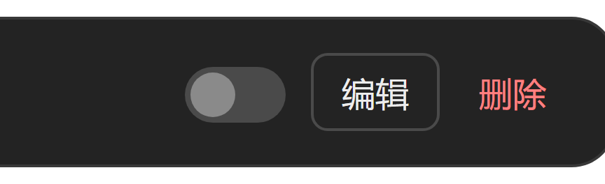

# dsh-provider-toggle

[English](README.md) | **中文**

   

> 给 DSH「设置 → 模型」的每一行加一个**一键开关**（就在「编辑」左边）：
> 关掉哪个提供商，它就从主界面「选择模型」栏里消失；再打开就回来。


*开关落在每行「编辑」按钮左边（离线几何验证台截图，3 行全部通过）。*

```
设置 → 模型
┌──────────────────────────────────────────────────────┐
│ opencode-go                   ●   ( )  编辑   删除   │  ← 开关在「编辑」左边
│                                   ↑                  │
└──────────────────────────────────────────────────────┘
```

---

## 目录

- [安装 / 升级](#安装--升级)
- [怎么实现的](#怎么实现的)
- [环境与兼容](#环境与兼容)
- [开发](#开发)
- [故障排查](#故障排查)
- [已知边界](#已知边界)
- [文件](#文件)
- [许可](#许可)

---

## 安装 / 升级

从 GitHub 一行装：

```sh
dsh plugin --profile desktop add github:DeepseekDays/dsh-provider-toggle
```

（profile 名不是 `desktop` 就换成你自己的。）

从本地检出装（同样三步，但不跑 pnpm）：

```sh
node install.mjs              # 安装或修复
node install.mjs --dry        # 只看会改什么
node install.mjs --uninstall  # 卸载（保留插件目录）
```

`install.mjs` 只做三件事（不跑 pnpm，不会重建 node_modules、不会打断会话）：
建目录联接、往 profile 的 `package.json` 里加 `link:` 依赖、把包名追加到
`dsh.profile.bundles` 末尾。改清单前会先写一份 `.bak-provider-toggle-*` 备份。
profile 目录默认 `~/.dsh/profiles/desktop`，可用 `DSH_PROFILE_DIR` 指定别的。

**装完必须完全退出 DSH（含托盘）再启动** —— bundle 清单和浏览器模块表都是启动期
读的，HMR 不会热加载新包。

## 怎么实现的

只有一个关键点：**DSH 的模型选择器只显示"模型数 > 0"的提供商分组**。

`@deepseek-ai/dsh-api-session-controller` 的 `buildModelCatalog()` 里有一句

```js
groups.filter(group => group.models.length > 0)
```

所以本插件用最轻的方式接上去 —— 包一层 `ctx.llm.listModels()`：

| 半端 | 文件 | 做什么 |
|---|---|---|
| host | `index.js` | 被关掉的 provider route，`listModels()` 返回 `[]` → 该分组被丢弃 → 选择器里消失 |
| client | `client.js` | 在 `settings.models.provider-card`（keyed slot）里渲染 `@deepseek-ai/dsh-client-ui-primitives` 的 `<Switch>`，读写走现成的 `ctx.remote.settings` |

**只影响目录/选择器，不影响路由。** `dsh-llm` 源码写得很清楚：
*"Core routing accepts unlisted model ids; catalog-driven entry points such as the GUI may require membership."*
也就是说，已经选着这个模型的旧会话不会被弄坏，只是选择器里不再提供它。

### 状态存在哪

存在插件自己的 settings 命名空间里（`Config.disabled`，`.volatile()`）：

- 走 DSH 原生 settings 服务 → 持久化进 **profile 的 `cordis.patch.yml`**
  （`id: dsh-provider-toggle` 那条）；
- 浏览器半端直接用 `ctx.remote.settings.describe() / mutate()`，不需要自造远程接口；
- 在设置界面改任何 provider 时，DSH 会整份重写 `cordis.patch.yml` —— 但那是按
  内存状态重写的，我们的值本来就在内存里，所以**不会被冲掉**；
- `.volatile()` 让改动**热生效**：写入后 loader 发 `loader/volatile-update`，
  本插件随即广播 `llm/adapters-updated`，浏览器当场重载模型目录。**开关不需要重启 DSH。**

### 为什么所有 provider 只注册了一条

`settings.models.provider-card` 是 **keyed** slot，渲染时用
`renderSlot(name, props, { entryKey: row.entry.settingsNs })` 匹配注册项的 `key`。
而 pi-ai 的所有路由（DeepSeek / openai / opencode-go / 自定义中转…）**共用同一个
settingsNs**（逐 provider 的区别在 `settingsPath: ["providers", <route>]`）。
所以**一条 key 的注册会在每一行各渲染一次**，props 里带着当行的 `provider`。
`deepseek-account` 之类的独立命名空间会另注册一条。

### 位置是怎么定的

slot 的内容默认渲染在 rowHead **下面**（同一张卡片里）。为了放到「编辑」左边，
组件挂载后测量 `li` / `[class*="rowHead"]` / `[class*="rowActions"]` 的
`getBoundingClientRect()`，把自己绝对定位过去（类名是 CSS Module 哈希，
所以用 `[class*=...]` 子串选择器）。**量不到就退回行内布局，功能不受影响。**

## 环境与兼容

- 需要提供 `settings.models.provider-card` keyed slot 与
  `@deepseek-ai/dsh-client-ui-primitives` 的 DSH（实测 DSH Desktop `2.0.17` /
  `dsh-base` `0.2.0-rc.2`）。
- `package.json` 里声明了 `dsh.bundle`，所以能直接用 `dsh plugin add` 装。
- **不改任何内核文件。** 运行时包一层 `ctx.llm.listModels()`，卸载时还原
  （带引用计数，重复 apply / 卸载不会叠加包装）。
- **与 `dsh-ofm-model-manager` 共存**（逐模型启用/停用与改名）：两者包装同一个
  `listModels`、都带引用计数，偏好键互相独立。
- 运行时依赖：**无**。

## 开发

```sh
node test-filter.mjs              # host 逻辑：16 项
node test-client.mjs              # client 逻辑：13 项
node preview/placement-check.mjs  # 版式几何 + 截图
```

三个离线验证台（前两个不需要 DSH 会话，也不需要网络）：

| 文件 | 覆盖 |
| --- | --- |
| `test-filter.mjs` | host 逻辑：关掉后真的从目录里消失？打开真的回来？卸载真的还原？重复 apply 会叠加吗？config 不是 ref 时的兜底路径 |
| `test-client.mjs` | 用最小化的假 React 加载 `client.js`：插槽注册形状、`Switch` 状态、`mutate` 的精确入参、命名空间不可用时静默不渲染 |
| `preview/placement-check.mjs` | 几何：从**真实 DSH 安装**抽出真 CSS 与 client.js 里**真的 `placeSwitch()`**，搭 DOM 复刻，用本机 Edge + CDP 量几何并截图 |

这些台子都**自己独立实现一遍口径**（复刻 DSH 的
`groups.filter(group => group.models.length > 0)`，而不是调用被测代码），
所以不会因为"跟自己一致"而通过。几何台需要 `DSH_APP_DIR`
（默认 `F:/DSH/DSH Desktop/resources/app`）与 `EDGE_PATH`。

## 故障排查

| 现象 | 原因 / 处理 |
| --- | --- |
| 完全没有开关 | bundle 没被读取：**完全退出 DSH（含托盘）再启动**。确认包名在 `dsh.profile.bundles` 里。 |
| 开关显示在行内，不在「编辑」左边 | 测量失败 —— DSH 大概改了设置页的行结构（类名里没有 `rowHead` / `rowActions` 了）。功能照常。 |
| 点开关没反应 | settings 命名空间没暴露（控制台会有 `settings namespace "dsh-provider-toggle" is not exposed`），或写入被拒（字段没标 volatile）。 |
| 被关掉的提供商整行没了 | 这是设计行为。救法：设置 → 模型 → 把开关打开，或编辑 profile 的 `cordis.patch.yml` 清空 `id: dsh-provider-toggle` 那条的 `config.disabled`。 |

## 已知边界

- **不给 `deepseek-account`（DeepSeek 账号）开关**。`@deepseek-ai/dsh-client-ui-settings-models`
  在装行列表时会查一次 `remote.session.modelCatalog()`，并且有一句
  `rows.filter(row => row.entry.provider !== "deepseek-account" || row.accountAvailable === true)`
  —— 也就是说这个 provider 一旦被从模型目录摘掉，**它自己那一行也会消失**，
  界面里就再没有把它开回来的入口了（只能手改 profile 的 `cordis.patch.yml`）。
- **别关掉你正在用的默认模型所在的那个 provider**：模型选择器里它会变成"不可用"，
  请求本身还是通的，但你会先切到别的模型去。改错的救法：设置 → 模型 → 打开开关，
  或编辑 profile 的 `cordis.patch.yml` 把 `id: dsh-provider-toggle` 那条
  `config.disabled` 清空。
- 这个开关只改"选择器里出现什么"，不改任何 provider 的配置、密钥和模型目录 ——
  所以它和「编辑 / 删除」是完全正交的两件事，随时可逆。
- 位置靠测量，所以 DSH 哪天把设置页的行结构改掉（类名里的 `rowHead` / `rowActions`
  没了），开关会退回"行内显示"——功能照常，只是位置不再是「编辑」左边。
- 第三方客户端（如市场里的独立面板）如果自己拉一份模型目录，不受本插件影响。

## 文件

```
index.js                     host 半端：逐 provider 过滤 listModels()
client.js                    浏览器半端：设置行里的开关
cordis.patch.yml             bundle 声明
install.mjs                  安装 / 卸载 / dry run
preview/placement-check.mjs  离线几何验证台
preview/placement.html       验证台用的 DOM 复刻
preview/*.png                验证台截图
test-filter.mjs              host 验证台
test-client.mjs              client 验证台
test-resolve-hook.mjs        模块解析冒烟测试
assets/                      README 用的截图
```

## 许可

MIT —— 见 [LICENSE](LICENSE)。
